# Rancangan Awal Proyek Replika Crunchyroll
*Dokumen Panduan Teknis & Manajemen Tim (Edisi Proyek: crunchyroll_pemvis_5)*

Dokumen ini disusun untuk memandu jalannya proyek tim pembuatan replika aplikasi Crunchyroll. Proyek ini difokuskan pada implementasi UI/UX dan Manajemen Database menggunakan Firebase (Auth & Firestore) pada platform Android dengan bahasa pemrograman **Kotlin** dan **Gradle Version Catalog (libs.versions.toml)**.

*Catatan: Dokumen ini telah dimodifikasi agar sesuai dengan kondisi di mana Anda tidak membagikan ZIP proyek dasar di awal kepada Teman A & B. Proses merger akan dilakukan langsung secara manual dari proyek independen mereka.*

---

## 1. Arsitektur Halaman Aplikasi (Berdasarkan Screenshot UI)

Aplikasi memiliki **5 Tab Utama** pada Bottom Navigation Bar, dengan struktur detail sebagai berikut:

```mermaid
graph TD
    Nav[Bottom Navigation Bar] --> Tab1[1. Beranda / Home]
    Nav --> Tab2[2. Daftar Saya / My Lists]
    Nav --> Tab3[3. Telusuri / Browse]
    Nav --> Tab4[4. Simulcast / Sparkles]
    Nav --> Tab5[5. Akun / Profile]

    Tab1 --> HomeDetail[Hero Banner Featured, Mulai Menonton E1, List Horizontal 'Trending in Indonesia']
    
    Tab2 --> SubTab2_1[Daftar Tonton / Watchlist - Kosong & Terisi]
    Tab2 --> SubTab2_2[Crunchylist - Playlist Kustom, Rename, Hapus]
    Tab2 --> SubTab2_3[Riwayat / History - Riwayat Menonton & Hapus Riwayat]
    Tab2 --> SubTab2_4[Unduhan / Downloads - Kosong, Mega Fan Option, Simulasi Unduhan]

    Tab3 --> SubTab3_1[Semua Anime - Grid Populer 2 Kolom]
    Tab3 --> SubTab3_2[Simulcast - Sub-tab Rilis Musim]
    Tab3 --> SubTab3_3[Genre Anime - Grid Kategori Aksi, Petualangan, Romansa, dll.]
    Tab3 --> SubTab3_4[Musik - Putar Musik Band & Artis Populer]

    Tab4 --> SimulcastPage[Season Simulcast - Dropdown Musim Panas 2026 & List Anime]

    Tab5 --> ProfilePage[Beralih Profil, Edit Profil, Kata Sandi, Ubah Email, Reset Kata Sandi, Kualitas Unduhan, Pembatasan Konten]
```



### Pembagian Tugas Kelompok (3 Orang)

| Anggota Tim | Peran Teknis | Halaman & UI yang Dikerjakan |
| :--- | :--- | :--- |
| **Teman A** | UI Developer A | - **Halaman Beranda (Home)**: Hero Banner, tombol putar, horizontal list "Trending in Indonesia".<br>- **Episode Viewer / Player UI**: Mockup pemutar video (Play, Pause, Seek 10s, Fullscreen overlay), metadata episode (like/dislike, unduh), & "Episode Berikutnya". |
| **Teman B** | UI Developer B | - **Halaman Telusuri (Browse)**: Tab "Semua Anime" (Grid Populer 2 kolom), Tab "Genre Anime" (Grid Kategori dengan gambar latar), Tab "Musik" (Featured band & Artist we love), dan Dialog Filter (Tampilkan, Bahasa). |
| **Anda (Pemeran Utama)** | Pemimpin Teknis & Database | - **Folder Proyek Baru** `crunchyroll_pemvis_5`.<br>- **Integrasi Firebase (Auth & Firestore)**.<br>- **Halaman Login & Register** & **Reset Password** (Reset email link & New password).<br>- **Halaman Daftar Saya (My Lists)**: Tab "Daftar Tonton", "Crunchylist" (Buat/Ganti Nama/Hapus), "Riwayat" (List & Hapus), dan "Unduhan" (Empty states/Jadilah Premium).<br>- **Halaman Season Simulcast**: Tab ke-4 (Sparkles) dengan dropdown musim.<br>- **Halaman Akun & Detail Profil**: Edit Profil (Nama, Username), Beralih Profil, preferensi bahasa (Audio/Subtitle), pembatasan rating usia.<br>- **Halaman Detail Anime**: Banner, logo anime, rating bintang (contoh: 4.9), tombol "+ Daftar Saya", list episode (dropdown season).<br>- **Merge Manager**: Penggabungan file zip dengan package name berbeda dari Teman A & B. |

---

## 2. Langkah Kerja (Roadmap) Proyek

1. **Tahap 1: Inisialisasi Proyek Baru `crunchyroll_pemvis_5`**
   * Anda membuat proyek baru di Android Studio dengan nama folder `crunchyroll_pemvis_5` and package name `com.example.crunchyroll_pemvis_5`.
   * Teman A dan Teman B membuat proyek Android Studio mereka sendiri secara terpisah dengan package name masing-masing (tanpa menggunakan file ZIP dasar dari Anda).
2. **Tahap 2: Setup Database & Firebase (Oleh Anda)**
   * Konfigurasi Firebase Auth & Firestore di proyek baru Anda menggunakan package name `com.example.crunchyroll_pemvis_5` (lihat detail di bagian 4).
3. **Tahap 3: Pengerjaan Mandiri**
   * Setiap anggota mengerjakan bagian halamannya masing-masing pada proyek lokal masing-masing secara independen.
4. **Tahap 4: Penggabungan Berkas & Penyesuaian Impor Kode (Oleh Anda)**
   * Teman A & B mengirimkan ZIP hasil kerja mereka.
   * Anda melakukan impor manual layout, file Kotlin, dan aset gambar ke dalam proyek `crunchyroll_pemvis_5` Anda, lalu melakukan refactoring pada package name dan kelas `R` (lihat detail di bagian 5).
5. **Tahap 5: Integrasi Firestore Dinamis**
   * Anda menghubungkan data dari Firestore ke dalam UI buatan Teman A (Home) dan Teman B (Browse) agar datanya tidak hardcoded.
6. **Tahap 6: Pengujian & Finalisasi**
   * Jalankan aplikasi secara keseluruhan untuk memverifikasi alur navigasi dan sinkronisasi Firebase.

---

## 3. Arsitektur Database Firebase (Cloud Firestore)

Untuk mendukung semua fitur dinamis dari screenshot UI (Watchlist, Crunchylist, History, Simulcast, Detail Episode, Kategori), kita memerlukan struktur NoSQL berikut:

### A. Koleksi `users`
*   **Path:** `/users/{userId}`
*   **Struktur Data:**
```json
{
  "uid": "Wv72Nsq9MdaL123...",
  "username": "crunchy_fan",
  "email": "kemayoranvhatlast14@gmail.com",
  "profileName": "Moon",
  "membershipType": "Fan", // Free, Fan, Mega Fan
  "contentRatingRestriction": "16+", // ALL, PG, 12+, 14+, 16+, 18+
  "audioLanguage": "Bahasa Indonesia",
  "subtitleLanguage": "English",
  "createdAt": "2026-05-27T12:00:00Z"
}
```

### B. Koleksi `anime`
*   **Path:** `/anime/{animeId}`
*   **Struktur Data:**
```json
{
  "animeId": "jujutsu-kaisen",
  "title": "Jujutsu Kaisen",
  "description": "Although born with tremendous power, Itadori Yuji...",
  "imageUrl": "https://url-ke-gambar-cover.jpg",
  "bannerUrl": "https://url-ke-banner.jpg",
  "genres": ["Action", "Adventure", "Fantasy"],
  "rating": 4.9,
  "ratingCount": "785R",
  "status": "Ongoing",
  "releaseYear": 2020,
  "simulcastSeason": "Musim Panas 2026",
  "isSimulcast": true,
  "audioLanguages": ["Jepang", "Bahasa Indonesia", "English"],
  "subtitleLanguages": ["Bahasa Indonesia", "English"]
}
```

### C. Subkoleksi `episodes` (Berada di dalam dokumen `anime`)
*   **Path:** `/anime/{animeId}/episodes/{episodeId}`
*   **Struktur Data:**
```json
{
  "episodeId": "e1-ryomen-sukuna",
  "episodeNumber": 1,
  "title": "Ryomen Sukuna",
  "durationText": "23m",
  "synopsis": "Mahito deftly uses Yoshino's admiration...",
  "thumbnailUrl": "https://url-ke-gambar-episode.jpg",
  "downloadSizeText": "421 MB",
  "likesCount": 28,
  "dislikesCount": 2
}
```

### D. Koleksi `watchlists` (Daftar Tonton)
*   **Path:** `/watchlists/{watchlistId}`
*   **Document ID:** `${userId}_${animeId}`
*   **Struktur Data:**
```json
{
  "watchlistId": "Wv72Nsq9MdaL123_jujutsu-kaisen",
  "userId": "Wv72Nsq9MdaL123...",
  "animeId": "jujutsu-kaisen",
  "addedAt": "2026-05-27T15:30:00Z"
}
```

### E. Koleksi `crunchylists` (Playlist Kustom Pengguna)
*   **Path:** `/crunchylists/{listId}`
*   **Struktur Data:**
```json
{
  "listId": "random_list_id_123",
  "userId": "Wv72Nsq9MdaL123...",
  "listName": "Daftar 1",
  "animeIds": ["attack-on-titan", "solo-leveling"],
  "updatedAt": "2026-05-26T15:30:00Z"
}
```

### F. Koleksi `histories` (Riwayat Tonton)
*   **Path:** `/histories/{historyId}`
*   **Document ID:** `${userId}_${animeId}`
*   **Struktur Data:**
```json
{
  "historyId": "Wv72Nsq9MdaL123_jujutsu-kaisen",
  "userId": "Wv72Nsq9MdaL123...",
  "animeId": "jujutsu-kaisen",
  "episodeNumber": 1,
  "episodeTitle": "Ryomen Sukuna",
  "timeLeftText": "23m tersisa",
  "progressPercentage": 5,
  "watchedAt": "2026-05-27T16:00:00Z"
}
```

---

## 4. Panduan Setup Firebase untuk Pemula (Kotlin & Version Catalog)

Konfigurasi Firebase menggunakan **Gradle Version Catalog (`libs.versions.toml`)** pada proyek baru `crunchyroll_pemvis_5`:

### Langkah 1: Registrasi Proyek di Firebase Console
1. Buka [Firebase Console](https://console.firebase.google.com/).
2. Buat proyek baru bernama `Crunchyroll Pemvis 5`.
3. Daftarkan aplikasi Android Anda dengan package name **`com.example.crunchyroll_pemvis_5`**.
4. Klik **Register app**.

### Langkah 2: Simpan file Konfigurasi
1. Unduh file `google-services.json`.
2. Letakkan file `google-services.json` ke dalam direktori `app/` proyek baru Anda.

### Langkah 3: Konfigurasi File Gradle (Version Catalog)

Buka dan edit file-file berikut pada proyek baru Anda secara berurutan:

#### 1. Tambahkan Dependency ke `gradle/libs.versions.toml`
```toml
[versions]
# ... versi yang sudah ada ...
googleServices = "4.4.1"
firebaseBom = "33.1.0"

[libraries]
# ... library yang sudah ada ...
firebase-bom = { group = "com.google.firebase", name = "firebase-bom", version.ref = "firebaseBom" }
firebase-analytics = { group = "com.google.firebase", name = "firebase-analytics" }
firebase-auth = { group = "com.google.firebase", name = "firebase-auth" }
firebase-firestore = { group = "com.google.firebase", name = "firebase-firestore" }

[plugins]
# ... plugin yang sudah ada ...
google-services = { id = "com.google.gms.google-services", version.ref = "googleServices" }
```

#### 2. Terapkan Plugin di Root `build.gradle.kts` Proyek Baru
```kotlin
plugins {
    alias(libs.plugins.android.application) apply false
    alias(libs.plugins.kotlin.android) apply false
    alias(libs.plugins.google.services) apply false
}
```

#### 3. Terapkan Plugin dan Dependency di `app/build.gradle.kts` Proyek Baru
```kotlin
plugins {
    alias(libs.plugins.android.application)
    alias(libs.plugins.kotlin.android)
    alias(libs.plugins.google.services)
}

// ... bagian android { } ...

dependencies {
    // ... dependencies bawaan ...
    
    // Integrasi Firebase Platform (Firebase BoM)
    implementation(platform(libs.firebase.bom))
    
    // Pustaka Firebase
    implementation(libs.firebase.analytics)
    implementation(libs.firebase.auth)
    implementation(libs.firebase.firestore)
}
```

Setelah selesai, lakukan **Sync Now** di Android Studio.

---

## 5. Panduan Kolaborasi & Penggabungan Manual (Berbeda Package Name)

Karena Anda tidak membagikan proyek dasar ber-package name sama di awal, proses penggabungan secara manual dari proyek independen Teman A & B **tetap aman dan bisa dilakukan** dengan mengikuti langkah-langkah berikut secara teliti:

### A. Syarat Keberhasilan Merger Manual
1. **Nama Layout Harus Unik**: Teman A & B wajib membuat nama layout XML baru yang tidak bertabrakan dengan layout Anda (misal: `activity_home.xml` untuk Teman A, dan `activity_browse.xml` untuk Teman B).
2. **Nama Berkas Kotlin Harus Unik**: Nama file activity/adapter/model buatan teman tidak boleh sama dengan yang telah Anda buat di `crunchyroll_pemvis_5`.

### B. Langkah Penggabungan File ZIP (Langkah demi Langkah)

#### Langkah 1: Cadangkan (Backup) Proyek Anda
Salin folder proyek `crunchyroll_pemvis_5` Anda ke folder cadangan (misal: `crunchyroll_pemvis_5_BACKUP`). Ini penting agar jika terjadi kesalahan, kode Anda tidak hilang.

#### Langkah 2: Salin Layout XML dan Drawable Aset
Buka folder ZIP dari teman Anda:
*   Salin semua file layout (XML) dari folder `res/layout` teman Anda ke folder `app/src/main/res/layout/` di proyek `crunchyroll_pemvis_5` Anda.
*   Salin seluruh aset gambar/ikon dari folder `res/drawable` teman Anda ke folder `app/src/main/res/drawable/` Anda.
*   *(Layout XML tidak menyimpan package name, jadi bagian ini tidak akan menimbulkan error).*

#### Langkah 3: Salin File Kelas Kotlin (`.kt`)
*   Salin file-file Kotlin (Activity, Adapter, Helper) milik teman Anda dari folder asal ZIP mereka.
*   Letakkan file tersebut langsung ke folder package utama Anda di:
    `app/src/main/java/com/example/crunchyroll_pemvis_5/`
*   *(Perhatian: Jangan salin folder package lama milik teman Anda. Letakkan semua file Kotlin tersebut langsung sejajar di bawah package Anda).*

#### Langkah 4: Sesuaikan Deklarasi Package di File Kotlin yang Baru Disalin
Buka file Kotlin milik teman Anda yang baru saja Anda salin ke proyek Anda. Baris pertamanya pasti berwarna merah/error.
*   Ubah baris package paling atas yang tadinya:
    `package com.example.projek_teman_anda`
*   **Menjadi package name proyek Anda:**
    `package com.example.crunchyroll_pemvis_5`

#### Langkah 5: Refactor / Ubah Impor Kelas `R`
Karena file Kotlin teman Anda merujuk pada layout proyek lamanya, baris impor kelas `R` akan error.
*   Hapus baris impor lama milik teman Anda yang merujuk pada kelas R lama, contohnya:
    `import com.example.projek_teman_anda.R`
*   **Ganti menjadi impor R proyek Anda:**
    `import com.example.crunchyroll_pemvis_5.R`
*   *Tips Cepat: Anda bisa menekan tombol **Alt + Enter** pada teks `R` berwarna merah di kode Kotlin, lalu pilih opsi untuk mengimpor kelas `R` dari package proyek Anda.*

#### Langkah 6: Daftarkan Activity Baru di `AndroidManifest.xml`
Karena Anda mengimpor file Kotlin secara manual, Android Studio tidak akan otomatis mendaftarkannya di Manifest. Buka `app/src/main/AndroidManifest.xml` proyek Anda, lalu daftarkan Activity baru tersebut:
```xml
<activity
    android:name=".HomeActivity"
    android:exported="false" />
<activity
    android:name=".BrowseActivity"
    android:exported="false" />
```

#### Langkah 7: Clean & Rebuild Project
Lakukan penyegaran build cache di Android Studio:
*   Pilih menu **Build > Clean Project**
*   Pilih menu **Build > Rebuild Project**

Proyek baru Anda kini siap dijalankan bersama-sama!

---

## 6. Rekomendasi Tambahan untuk Kesuksesan Proyek

*   **Pemuat Gambar**: Gunakan **Coil** (tambahkan `implementation(libs.coil)` di `app/build.gradle.kts`).
*   **Keamanan Firestore**: Terapkan rules pembatasan baca/tulis sesuai dengan ID pengguna (`request.auth.uid`).
*   **Desain Warna**: Gunakan Orange Crunchyroll (`#F37022`) sebagai warna aksen dan Dark Theme (`#141519`) agar terkesan premium.
